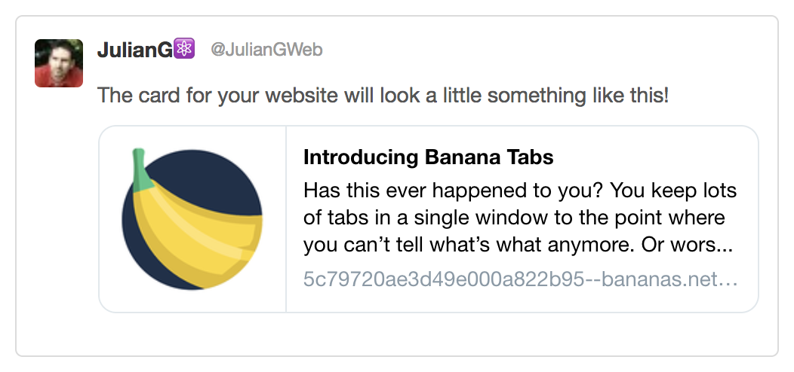

I have a blog based on the [Gatsby Starter Blog](https://www.gatsbyjs.org/starters/gatsbyjs/gatsby-starter-blog/) without any modifications.

## The Problem

I want my posts to have a nice image when sharing them on social media. 

A simple inspection of the generated HTML reveals that the Gatsby Blog renders (amongst others) the following [meta tags](https://developer.mozilla.org/en-US/docs/Web/HTML/Element/meta):

```html
<meta property="description" ... />
<meta property="og:title" ... />
<meta property="og:description" ... />
<meta property="og:type " ... />
<meta property="twitter:title" ... />
<meta property="twitter:description" ... />
```

It doesn't render `og:image`, `image` nor `twitter:image`, which are needed to properly share the articles on Twitter, Facebook, and other websites using [Open Graph](http://ogp.me/).

To see what our blog post link will look like on social media we can use [Twitter Card Validator](https://cards-dev.twitter.com/validator), [Facebook Sharing Debugger](https://developers.facebook.com/tools/debug/), or we can simply read the Open Graph metadata using [Open Graph Check](https://opengraphcheck.com/).



## The Requirement

We want to have a default (or fallback image) for the blog's home page and have the option to specify a custom image (even if it's not in the article's body).

## The Solution

First let's add an `ogimage` property in the top section (frontmatter) of one of the blog posts.

```diff
---
 title: Hello!
 date: '2018-12-01'
+ogimage: './opengraph-default.png'
---
```
<br/>

After restarting `gatsby deveop`, we now can add `ogimage` to the GraphQL query in **src/templates/blog-post.js**.

```diff
 markdownRemark(fields: { slug: { eq: $slug } }) {
   id
   excerpt(pruneLength: 160)
   html
   frontmatter {
     title
     date(formatString: "MMMM DD, YYYY")
+    ogimage { 
+      childImageSharp {
+        fixed {
+          src
+        }
+      }
+    }
   }
 }
```
<br/>

The next step is obtaining a file path for the `ogimage` property in a blog post, and then passing it to the `SEO` component. Still in **src/templates/blog-post.js**:

```diff
 class BlogPostTemplate extends React.Component {
   render() {
     const post = this.props.data.markdownRemark
     const siteTitle = this.props.data.site.siteMetadata.title
     const { previous, next } = this.props.pageContext
+    const { ogimage } = post.frontmatter
+    const ogImagePath = ogimage && ogimage.childImageSharp.fixed.src

    return (
      <Layout location={this.props.location} title={siteTitle}>
        <SEO
          title={post.frontmatter.title}
          description={post.excerpt}
+          image={ogImagePath}
        />

```

<br/>

The `SEO` component (in **src/components/seo.js**) now needs to accept an `image` prop.

```diff
- function SEO({ description, lang, meta, keywords, title }) {
+ function SEO({ description, lang, meta, keywords, title, image }) {  
```

<br/>

If the `image` prop is undefined `SEO` will use a default value, which we need to import as a static image:

```diff
+ import defaultOpenGraphImage from '../../content/assets/opengraph-default.png'
```

...and then we use that as a fallback value.

```diff
 <StaticQuery
   query={detailsQuery}
   render={data => {
     const metaDescription =
       description || data.site.siteMetadata.description
+    const ogImageUrl = 
+      data.site.siteMetadata.siteUrl +
+      ( image || defaultOpenGraphImage )
     return (
       <Helmet
```

The `data.site.siteMetadata.siteUrl` expression above is needed to prefix the file path with the website's URL, but it will be undefined until we add `siteUrl` to the GraphQL query at the bottom of **seo.js**:

```diff
const detailsQuery = graphql`
  query DefaultSEOQuery {
    site {
      siteMetadata {
         title
         description
         author
+        siteUrl
      }
    }
  }
`
```

Now we can use `ogImageUrl` in the metadata:

```diff
  {
    property: `og:title`,
    content: title,
  },
  {
    property: `og:description`,
    content: metaDescription,
  },
+ {
+   property: `og:image`,
+   content: ogImageUrl,
+ },
+ {
+   property: `twitter:image`,
+   content: ogImageUrl,
+ },
+ {
+   property: `image`,
+   content: ogImageUrl,
+ },
```

And that's it!

We added a property to the **frontmatter** of blog posts. We then modified the GraphQL query in **blog-post.js** to read the property and passed it to the SEO component in **seo.js**. The SEO uses an imported image as fallback and then it renders the necessary meta tags using the post's image or the fallback one.

You can see a Pull Request with all the changes I did for my blog: https://github.com/JulianG/juliang-blog/pull/3/files

