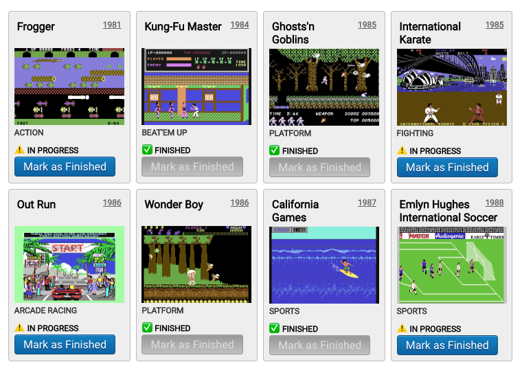

**In this series, instead of using a state-management library or proposing a one-size-fits-all solution, we start from the bare minimum and we build up our state management as we need it.**

In the first article we explained how to [Load and Display Data](https://dev.to/juliang/minimal-state-management-in-react-1el2-temp-slug-388480?preview=baffbcf3d1245bdac7ed54253dbbde16cb1020f2810a8261e2617efb4f5d8238324577fd36b84168f8b7315954c9d7f12485615b20c6d748b4cd111d), in this second article we'll see how to change it.

The final code can be found on [this GitHub repo](https://github.com/JulianG/minimal-state-management-demo). It's TypeScript, but the type annotations are minimal.

## Changing Remote Data with Hooks

Remember our list of games? **There's a new requirement:** We want to let the user mark each game as "finished". When they do, we send the changes to the server right away.



In order to change the value of `"status"` from `"in-progress"` to `"finished"` we make a **`PATCH`** request:

```js
const setGameStatus = (id: number, status: Game['status']): Promise<Game> => {
  return fetch('http://localhost:3001/games/' + id, {
    method: "PATCH",
    headers: { "Content-Type": "application/json" },
    body: JSON.stringify({ status: status })
    })
    .then(response => response.json());
}
```

Which we can use like this:

```js
const promise = setGameStatus(7, "finished");
```

**But, where do we put this code?**

We can approach the problem from the other end: **How would we like to use our hook?**

Let's create a `GameComponent` to render a single game with an onClick handler to mark it as finished.

----

***Note:*** *To keep this simple we'll make a quick `<pre>` with everything in it, including the `onClick` handler.*

----

```tsx
type GameComponentProps = { game: Game; markAsFinished: (id:number) => void };

const GameComponent = ({ game, markAsFinished }: GameComponentProps) => {
  return (
    <pre onClick={() => markAsFinished(game.id)}>
      Title: {game.title}
      Year: {game.year}
      Status: {game.status}
    </pre>
  );
};
```

This new component needs a `game` object and a `markAsFinished` function. So our custom hook should return a function along with list of games, error and pending:

```ts
//const { games, error, isPending } = useGames();
  const { games, error, isPending, markAsFinished } = useGames();
```

This would allow us to render the list of games like this:
```react
export const App = () => {
  const { games, error, isPending, markAsFinished } = useGames();

  return (
    <>
      {error && <pre>ERROR! {error}...</pre>}
      {isPending && <pre>LOADING...</pre>}
      <ol>
        {games.map(game => (
          <li key={game.id}>
            <GameComponent game={game} markAsFinished={markAsFinished} />
          </li>
        ))}
      </ol>
    </>
  );
};
```
That's what we would like to use. Let's change our `useGames` hook implementation.

Here's what it looks like so far:

```ts
export const useGames = () => {
  const [games, error, isPending] = useAsyncFunction(getGames, emptyList);
  return { games, error, isPending };
};
```

We need to return a `markAsFinished` function.

```js
export const useGames = () => {
  const [games, error, isPending] = useAsyncFunction(getGames, emptyList);

  const markAsFinished = (id: number) => {
    setGameStatus(id, 'finished'); // setGameStatus is already defined outside the hook
  };

  return { games, error, isPending, markAsFinished };
};
```

With this code (*[see repo](https://github.com/JulianG/minimal-state-management-demo/tree/04-patch-server-data/src)*) we are now sending our changes to the server, **but unless we reload the page and fetch the list of games again, our client-side data is not affected.**

### Updating client-side data

Now the server has the updated value, but the client does not: The list is not updated after a change.

```js
const markAsFinished = (id: number) => {
  setGameStatus(id, 'finished')
    .then(game => ?????); // 🤔
};
```

Our server's `PATCH` request returns a promise with the modified game object which we can use to update our client-side list. There's no need to re-fetch the list of games or even the affected game after "patching".

```ts
const markAsFinished = (id: number) => {
  setGameStatus(id, 'finished')
    .then(updateGame); // 🤔 we need to define updateGame
};
```

Our `updateGame` function will make a copy of the array of games, find the game by id and replace it with the new one.

```js
export const useGames = () => {
  const [games, error, isPending] = useAsyncFunction(getGames, emptyList);

  const updateGame = (game: Game) => {
    const index = games.findIndex(g => g.id === game.id);
    if (index >= 0) {
      const gamesCopy = games.slice();
      gamesCopy[index] = game;
      setGames(gamesCopy); // 🤔 I don't see setGames declared anywhere...
    }
  }
  const markAsFinished = (id: number) => {
    setGameStatus(id, 'finished').then(updateGame);
  };
  
  return { games, error, isPending, markAsFinished };
};
```

Oh! We don't have a `setGames` function. Our `useAsyncFunction` does not provide a way to set the value externally. But we don't want to modify it because in a real world project we'd probably replace its functionality with [react-async](https://www.npmjs.com/package/react-async).

We can change our `useGames` custom hook to keep state, and update it whenever the `fetchedGames` change (or when we call `setGames`, of course).

```ts
export const useGames = () => {
  const [fetchedGames, error, isPending] = useAsyncFunction(getGames, emptyList);

  const [games, setGames] = React.useState(emptyList); // 😎 now we have setGames!
  React.useEffect(() => {
    setGames(fetchedGames);
  }, [fetchedGames]);
  
  ...
```

Our `useGame` hook file now looks like this (*[see the entire file in the repo](https://github.com/JulianG/minimal-state-management-demo/blob/05-update-client-data/src/useGames.ts)*)

```ts
export const useGames = () => {
  const [fetchedGames, error, isPending] = useAsyncFunction(getGames, emptyList);

  const [games, setGames] = React.useState(emptyList);
  React.useEffect(() => {
    setGames(fetchedGames);
  }, [fetchedGames]);

  const updateGame = (game: Game) => {
    const index = games.findIndex(g => g.id === game.id);
    if (index >= 0) {
      const gamesCopy = games.slice();
      gamesCopy[index] = game;
      setGames(gamesCopy);
    }
  };
  const markAsFinished = (id: number) => {
    setGameStatus(id, 'finished').then(updateGame);
  };

  return { games, error, isPending, markAsFinished };
};
```

### Refactoring

That looks a bit messy. We can extract it to a custom hook:

```ts
const useFetchedGames = () => {
  const [fetchedGames, error, isPending] = useAsyncFunction(getGames, emptyList);

  const [games, setGames] = React.useState(emptyList);
  React.useEffect(() => {
    setGames(fetchedGames);
  }, [fetchedGames]);

  return {games, setGames, error, isPending};
}
```
```ts
export const useGames = () => {
  const { games, error, isPending, setGames } = useFetchedGames();
	...
}
```

(*[see the entire file in the repo](https://github.com/JulianG/minimal-state-management-demo/blob/05-update-client-data-refactored/src/useGames.ts)*)

### Handling errors

```
❌ 404 Not Found
```

Just like before, we've forgotten about handling errors. What happens when the `PATCH` request fails?

First of all, we have two functions calling the server but only one (`getGames`) checks the status code of the response.

```ts
const getGames = (): Promise<Game[]> => {
  return fetch('http://localhost:3001/games/').then(response => {
    if (response.status !== 200) {
      throw new Error(`${response.status} ${response.statusText}`);
    }
    return response.json();
  });
};

export const setGameStatus = (id: number, status: Game['status']): Promise<Game> => {
  return fetch('http://localhost:3001/games/' + id, {
    method: 'PATCH',
    headers: { "Content-Type": "application/json" },
    body: JSON.stringify({ status: status })
  }).then(response => response.json()); // 😰 no error handling
};
```

We don't want to repeat ourselves so we'll extract the error handling to a new function and use it in both cases.

```ts
function parseResponse<T>(response: Response): Promise<T> {
  if (response.status !== 200) {
    throw new Error(`${response.status} ${response.statusText}`);
  }
  return response.json();
}

export const getGames = (): Promise<Game[]> => {
  return fetch('http://localhost:3001/games/').then(response =>
    parseResponse(response)
  );
};

export const setGameStatus = (id: number, status: Game['status']): Promise<Game> => {
  return fetch('http://localhost:3001/games/' + id, {
    method: 'PATCH',
    headers: { 'Content-Type': 'application/json' },
    body: JSON.stringify({ status: status })
  }).then(response => parseResponse(response));
};
```

To keep things tidy, we move these functions to a new **gameClientAPI.ts** file (*[see repo](https://github.com/JulianG/minimal-state-management-demo/blob/06-error-handling-1/src/gameClientAPI.ts)*). Our `useGames` hook imports the functions from it. We're separating concerns and keep our files short.

Now we can catch errors from `markAsFinished`:

```ts
const markAsFinished = (id: number) => {
  setGameStatus(id, 'finished')
    .then(updateGame)
    .catch(error =>
      alert(
        `There was a problem updating this game.\n` +
          `Please try again later.\n\n` +
          `(${error.toString()})`
      )
    );
};
```

(*[see repo](https://github.com/JulianG/minimal-state-management-demo/blob/06-error-handling-2/src/useGames.ts)*)

## Conclusion

We have successfully wrapped an imperative API in a more declarative API in the form of a custom React hook so it can be used in React function components. When a component needs to access the list of games and make changes to it, it can simply import the `useGames` hook.

## What's next?

As long as the data is used by only one component, there is no need to have a global(ish) store, or use Redux or MobX. But if more than one component require access to the same data, we should "lift" it to a common ancestor component.

In cases where that common ancestor is not directly the parent of the consimung components, we can avoid prop-drilling by using React Context.

We'll see how we do that in the next post of this series.