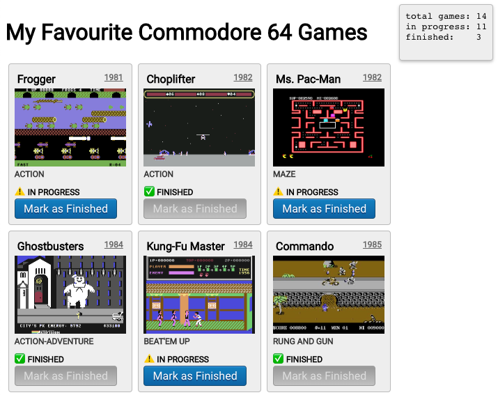
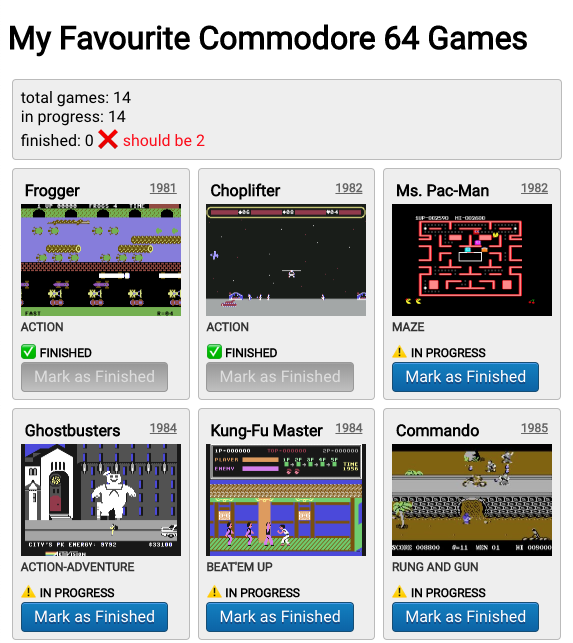
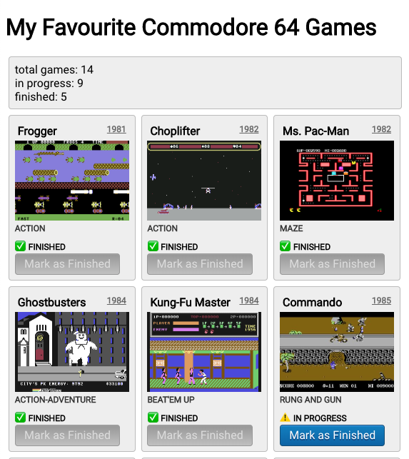

**In this series, instead of using a state-management library or proposing a one-size-fits-all solution, we start from the bare minimum and we build up our state management as we need it.**

----

* In the first article we described how we [load and display data with hooks](../).  
* In the second article we learned how to [change remote data with hooks](./).
* **In this third article we'll see how to share data between components with React Context, without using globals, singletons or resorting to state management libraries like MobX or Redux.**

----

The final code can be found in [this GitHub repo](https://github.com/JulianG/minimal-state-management-demo). It's TypeScript, but the type annotations are minimal.

## Sharing Remote Data with React Context

⚠️ **Before we begin**, you may want to check out [this tag from the repo](https://github.com/JulianG/minimal-state-management-demo/tree/07-adding-styles-and-images/src). The project has been improved from the last article with some styling and game screenshots.

Remember our list of games? **There's a third requirement:** We want to display a sign near the top of the page, indicating the total number of games, how many are finished and how many are in progress. Something like this:



### Lifting State to a common ancestor

**But first** let's imagine our `App` component is getting a bit more complex and we decide to break it into separate components. We'll create a `GamesScreen` and a  `GameGrid` component.

```
App
 +- GamesScreen (useGames hook here)
 		 +- Totals
 		 +- GameGrid
```

Now our `App` component is does not concern itself with fetching the games list. We do that in `GamesScreen`.

```tsx
export const App = () => {
  return (
    <>
      <h1>My Favourite Commodore 64 Games</h1>
      <GamesScreen />
    </>
  );
};
```

The new `GamesScreen` component uses our `useGames` custom hook to keep state and handle the error and pending states and eventually rendering two children components.

```tsx
export const GamesScreen = () => {
  const { games, error, isPending, markAsFinished } = useGames();

  return (
    <>
      {error && <pre>ERROR! {error}...</pre>}
      {isPending && <pre>LOADING...</pre>}
      <Totals games={games} />
      <GameGrid games={games} markAsFinished={markAsFinished} />
    </>
  );
};
```

We extracted some code to a `GameGrid` compoent.

```tsx
type GameGridProps = { games: Game[]; markAsFinished: (id: number) => void };

export const GameGrid = ({ games, markAsFinished }: GameGridProps) => {
  return (
    <div className="gamegrid">
      {games.map(game => (
        <GameComponent key={game.id} game={game} markAsFinished={markAsFinished} />
      ))}
    </div>
  );
};
```

And finally we can create a new `Totals` component:

```tsx
type TotalsProps = { games: Game[] };

export const Totals = ({ games }: TotalsProps) => {
  const totalGames = games.length;
  const inProgress = games.filter(g => g.status === 'in-progress').length;
  const finished = games.filter(g => g.status === 'finished').length;

  return (
    <div className="card">
      total games: {totalGames}<br />
      in progress️: {inProgress}<br />
      finished: {finished}
    </div>
  );
};
```

The resulting code can be found in the repo under the [08-lifting-state](https://github.com/JulianG/minimal-state-management-demo/tree/08-lifting-state/src) tag.

### Sharing State using hooks (the wrong way)

That's all we need to know if two sibling components need access to the same state.

 **But what if it we have a more complex component tree?**

If the components sharing state are far apart, getting the required props to each of them may result in [prop drilling](https://kentcdodds.com/blog/prop-drilling). Let's imagine an even more complex structure:

```
App
 +- GamesScreen (useGames hook here)
     +- MenuBar❗
         +- SomeOtherMenuComponent ❗
             +- Totals (requires the list of games)
     +- GamesPageContent❗
         +- SomeOtherComponent❗
             +- GameGrid (requires the list of games and the markAsFinished function)
```

With the above structure we would need to keep the state in `GamesScreen` because it's the lowe common ancestor to both `GameGrid` and `Totals`.

The problem is that in order to pass the required props, `MenuBar`, `SomeOtherMenuComponent`, `GamesPageContent` and `SomeOtherComponent` would require props with the list of `games` and the `markAsFinished` function, only to pass it down to some children component.

**We don't want to do that.  We can use [React Context](https://reactjs.org/docs/context.html) to solve this problem.**

**Note:** To keep the demo repository and this article simple we won't create any of those intermediate components marked with ❗️.  
We're going to **pretend** that the `GameGrid` and `Total` components are far apart.

Our current **GamesScreen.tsx**

```tsx
export const GamesScreen = () => {
  const { games, error, isPending, markAsFinished } = useGames(); ❌

  return (
    <>
      {error && <pre>ERROR! {error}...</pre>} ❌
      {isPending && <pre>LOADING...</pre>} ❌
      <Totals games={games} />
      <GameGrid games={games} markAsFinished={markAsFinished} />
    </>
  );
};
```

/////

//// from here!

////

If `Totals` and `GameGrid` are far appart they do not share a common parent (only a common ancestor higher up in the tree). That means we can't call the `useGames` hook here and pass some props down without resortingto prop-drilling, as explained above.

For now we're going to call `useGames` inside each of our components:

Updated **GamesScreen.tsx**

```tsx
export const GamesScreen = () => {
  return (
    <>
      <Totals />
      <GameGrid />
    </>
  );
};
```

Updated **GameGrid.tsx**

```tsx
export const GameGrid = () => {
  const { games, error, isPending, markAsFinished } = useGames();
  
  return (
    <div className="gamegrid">
      {error && <pre>ERROR! {error}...</pre>}
      {isPending && <pre>LOADING...</pre>}
      {games.map(game => (
        <GameComponent key={game.id} game={game} markAsFinished={markAsFinished} />
      ))}
    </div>
  );
};
```

The updated `GameGrid` component does not receive any props, and it has to handle the error and pending states itself.

Updated **Totals.tsx**

```tsx
export const Totals = () => {
  const { games } = useGames();

  const totalGames = games.length;
  const inProgress = games.filter(g => g.status === 'in-progress').length;
  const finished = games.filter(g => g.status === 'finished').length;

  return (
    <div className="card">
      total games: {totalGames}
      <br />
      in progress️: {inProgress}
      <br />
      finished: {finished}
    </div>
  );
};
```

We only use `{games}` from the custom hook, because we don't need `markAsFinished` function and we don't worry about error and pending states for this small component.

You can inspect the code from the repo using the [09-duplicating-state](https://github.com/JulianG/minimal-state-management-demo/tree/09-duplicating-state/src) tag.

**Wait wasn't this about React Context?**

The above code works because both components now access the same server API and request the same list of games. However, when we mark some games as finished, only the `GameGrid` component reflects this. The `Totals` component is not updated.



For example, after marking two games as finished, the `GameGrid` component shows them as finished, as expected, but the `Totals` component continues to report zero finished games.

**This is why we need to fetch and update only one list of games.**

### Sharing state using React Context (the right way)

OK. Let's see how we do this with React Context.

We're going to update our `GamesScreen` component, but we could do the same in  `App`.

```tsx
export const GamesScreen = () => {
  return (
    <GamesContextProvider>
      <Totals />
      <GameGrid />
    </GamesContextProvider>
  );
};
```

Instead of wrapping `Totals` and `GameGrid` in a fragment `<>`, we wrap them in a new `GamesContextProvider` component which we'll create next.

**GamesContext.tsx**

```tsx
type GamesContext = ReturnType<typeof useGames>;

export const gamesContext = React.createContext<GamesContext>({
  games: [],
  error: null,
  isPending: true,
  markAsFinished: () => {}
});

export const GamesContextProvider: React.FC = ({ children }) => {
  return <gamesContext.Provider value={useGames()}>{children}</gamesContext.Provider>;
};
```

*For more information see [Using React Context](https://reactjs.org/docs/context.html) and [React Hooks Reference: useContext](https://reactjs.org/docs/hooks-reference.html#usecontext).*

This is the simplest thing we could do. Then we update our `GameGrid` and `Totals` components to use the context like this:

```tsx
import { gamesContext } from '../GamesContext';

export const GameGrid = () => {
//const { games, error, isPending, markAsFinished } = useGames();
  const { games, error, isPending, markAsFinished } = React.useContext(gamesContext);
```

But there's a problem. If we forget to wrap this component in `GamesContextProvider` or if someone in the future accidentally removes it, there won't be any errors. The list of games will never be loaded, and the context will never change its value.

You can try it. Check out the [10-minimal-context](https://github.com/JulianG/minimal-state-management-demo/tree/10-minimal-context/src) and edit **GamesScreen.tsx** removing the context provider to see that the games never load.

A better approach is to use `undefined` as a default value for our context.

```ts
type GamesContext = ReturnType<typeof useGames>;

const gamesContext = React.createContext<GamesContext | undefined>(undefined);

export const useGamesContext = (): GamesContext => {
  const context = React.useContext(gamesContext);
  if (!context) {
    throw new Error(
      'useGameContext must be used in a component within a GameContextProvider.'
    );
  }
  return context;
};
```

We also create a custom `useGamesContext` hook that throws if the context is undefined, which can only happen if the provider is missing.

```tsx
import { useGamesContext } from '../GamesContext';

export const GameGrid = () => {
//const { games, error, isPending, markAsFinished } = React.useContext(gamesContext);
  const { games, error, isPending, markAsFinished } = useGamesContext();

```

We do the same in the `Totals` component.

```ts
import { useGamesContext } from '../GamesContext';

export const Totals = () => {
//const { games } = React.useContext(gamesContext);
  const { games } = useGamesContext();

```

That's it! The final version of code can be found in the [11-safe-context](https://github.com/JulianG/minimal-state-management-demo/tree/11-safe-context/src) tag.



## Conclusion

We have managed to share state in our aplication without making it global and without suffering from prop drilling. Any component requiring access to the games list can use the custom hook provided. This hooks exposes a function to mutate such data in a safe way, while immediately persisting it on the server according to our business logic.


