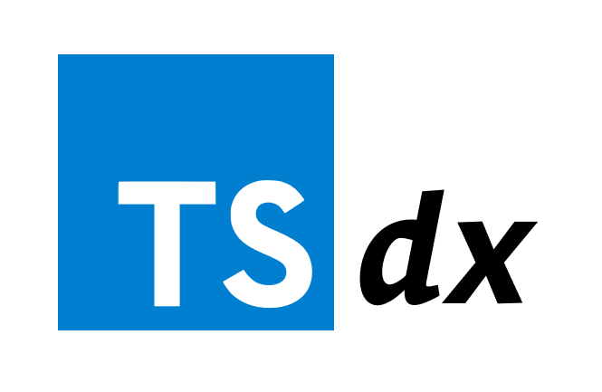

A few weeks ago, I created a custom React hook in a project. Sometime later I decided to start my personal hooks library and publish it as an **npm package**. Doing this in TypeScript was not straightforward, until: **[palmerhq/tsdx](https://github.com/palmerhq/tsdx)**.



Here's what I did. Step by step.

## Step 1: Create the project

```js
$ npx tsdx create bananahooks
```

The command is interactive and asks you to choose a template.

```
? Choose a template …
  basic
❯ react
```

I selected the `react` template, and TSDX installed everything for me.

```
✔ Choose a template · react
✔ Created bananahooks
✔ Installed dependecines

  Awesome! You're now ready to start coding.

  I already ran yarn install for you, so your next steps are:
    cd bananahooks

  To start developing (rebuilds on changes):
    yarn start

  To build for production:
    yarn build

  To test your library with Jest:
    yarn test

  Questions? Feedback? Please let me know!
  https://github.com/jaredpalmer/tsdx/issues
```

## Step 2: Add library code and tests

TSDX generates an `index.tsx` file a test file, and an example folder.  
I deleted the example folder, added my [own code](https://github.com/JulianG/hooks/tree/master/src) and [tests](https://github.com/JulianG/hooks/tree/master/test).

```
bananahooks                      bananahooks
└─ examples                      └─ src
└─ src                              └─ index.tsx
   └─ index.tsx                     └─ use-promise.tsx
└─ test                          └─ test
   └─ blah.test.tsx     ==>         └─ use-promise.test.tsx
└─ .gitignore                    └─ .gitignore
└─ package.json                  └─ package.json
└─ README.md                     └─ README.md
└─ tsconfig.json                 └─ tsconfig.json
└─ yarn.lock                     └─ yarn.lock
```

Because my library consists of only functions, I decided to delete the `example` folder, and I relied on tests instead. You can see how I test my custom hook in [use-promise.test.tsx](https://github.com/JulianG/hooks/blob/master/test/use-promise.test.tsx). I'm using [react-testing-library](https://github.com/testing-library/react-testing-library).

## Step 4: Testing the package locally

To make sure my package would work as expected I imported it to a new React project:

```
yarn add ../path/to/bananahooks
```

But there was a problem!

```error
Invalid hook call. Hooks can only be called inside of the body of a function component. This could happen for one of the following reasons:
1. You might have mismatching versions of React and the renderer (such as React DOM)
2. You might be breaking the Rules of Hooks
3. You might have more than one copy of React in the same app
See https://fb.me/react-invalid-hook-call for tips about how to debug and fix this problem.
```

There's a [known issue](https://github.com/yarnpkg/yarn/issues/1334) when installing local packages with **yarn** or **npm**. Everything is copied to the project's `node_modules` folder instead of just the files that would eventually be packaged. This means there's now two `node_modules` and therefore, two copies of React. It doesn't matter if it's the exact same version.  

The workaround is to `yarn remove bananahooks`, then delete the `node_modules` folder from the library project, then run `yarn add ../path/to/bananahooks` again. It's annoying.

## Step 5: Publish to NPM

TSDX generated a `package.json` file with my package name: `bananahooks`, but I had to add the `author`, `license` and `repository` keys to it:

```json
  "author": {
    "name": "Julian Garamendy",
    "email": "me@juliangaramendy.dev",
    "url": "https://juliangaramendy.dev"
  },
  "repository": {
    "type": "git",
    "url": "https://github.com/JulianG/hooks"
  },
  "license": "MIT",
```

### Publishing on NPM Registry

I ran the `npm pack` command which generates a `.tgz` file with the package that would be uploaded to the registry. I find this useful to inspect and make sure I'm including the right files. **The `.tgz` file can be deleted afterwards; it's not needed for publishing.**

Then I ran `npm publish` and ([because I'm already logged in to npm](https://docs.npmjs.com/cli/adduser)) my package was uploaded and added to the registry.

I can later increase the version number either by manually editing the `package.json` file or by running [`npm version`](https://docs.npmjs.com/cli/version.html).

## Conclusion

**[TSDX](https://github.com/palmerhq/tsdx)** makes creating TypeScript libraries really easy. I'll sure be using it a lot in the future.

You can see [my hooks repository on GitHub](https://github.com/JulianG/hooks), and the published [bananahooks](https://www.npmjs.com/package/bananahooks) package on NPM.

I hope this was useful.

