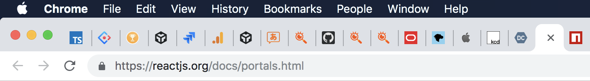
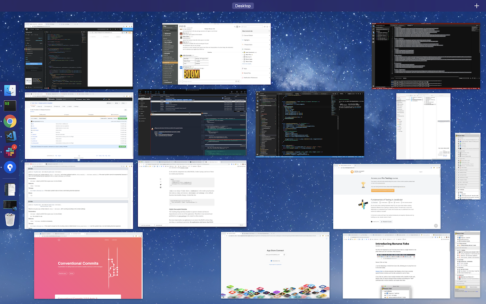
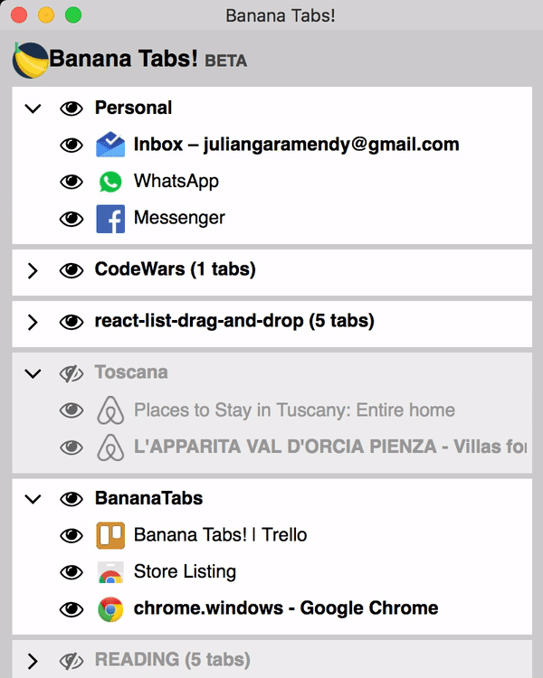

### Has this ever happened to you?

You keep lots of tabs in a single window to the point where you can't tell what's what anymore.

Or worse: you try -like me- to group your tabs by task, or subject, or anything, and as a result you end up with too many windows instead.

### Banana Tabs can help

[**Banana Tabs**](https://goo.gl/AyrUQL) is a chrome extension that displays a list of your currently opened browser windows and the tabs contained in each of them.

- You can show or hide each tab or window individually.
- You can re-arrange your windows in the list.
- You can name and rename windows

It's ideal to suspend some task and picking it up later.

You can even rearrange the windows in the list, to keep the most important at the top.

You can install [Banana Tabs!](https://goo.gl/AyrUQL) from the Chrome Web Store.

### Tech Stack

BananaTabs is written in [TypeScript](https://github.com/Microsoft/TypeScript). I have recently updated the project to [Create React App v2](https://github.com/facebook/create-react-app), so it uses [React 16.8](https://github.com/facebook/react) (with a few hooks), and TypeScript 3.3. Unit and integration tests use [jest](https://github.com/facebook/jest) and [react-testing-library](https://github.com/kentcdodds/react-testing-library).

Banana Tabs is open-source. You can clone/fork [the repo](https://github.com/julianG/bananatabs) or ideally contribute to the project.
