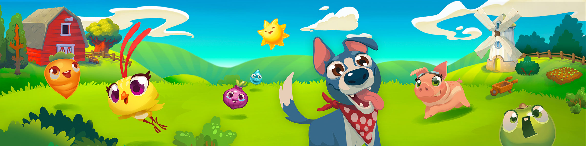

# Work

I work at **[TransferWise](https://transferwise.com)** as a Front End Engineer, using React with TypeScript.

---

I used to work at [King.com](https://king.com/) creating tools for game development teams.  
We mostly used React and TypeScript, and some C++.

Before that, I developed successful mobile games such as [Farm Heroes Saga](https://king.com/game/farmheroes) and [Shuffle Cats](https://king.com/game/shufflecats).  
I used C++, C#, ActionScript and Python.

---

During my time at **Miniclip.com** I created video games for the browser.

We developed single-player and multi-player games in ActionScript 3.  
We also developed components to integrate third party games with Miniclip's systems.  
I also contributed with some server-side PHP code.

---

Before moving to the UK, I was a **Freelance Web Developer**.  
I developed websites for several clients and design agencies using HTML CSS, JavaScript, PHP, MySQL, and Flash.

---

I started my career as a front-end developer at **CyberJuegos.com** during the dot-com bubble, building web pages using HTML, CSS, and some ASP.  
Later on, I was involved in game development in Macromedia Shockwave.
